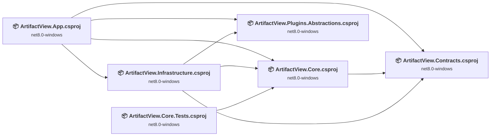
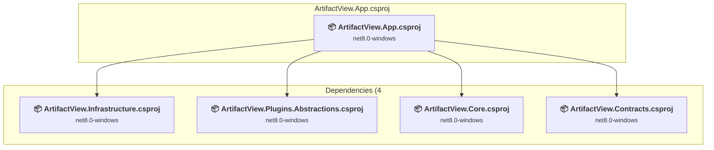
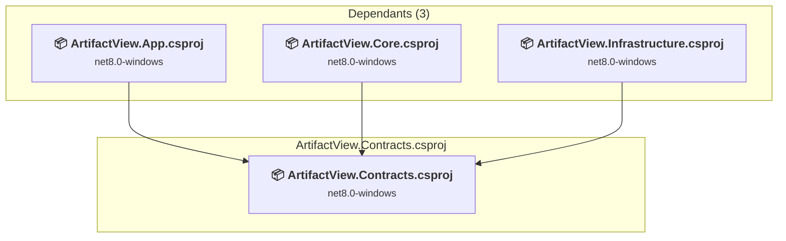
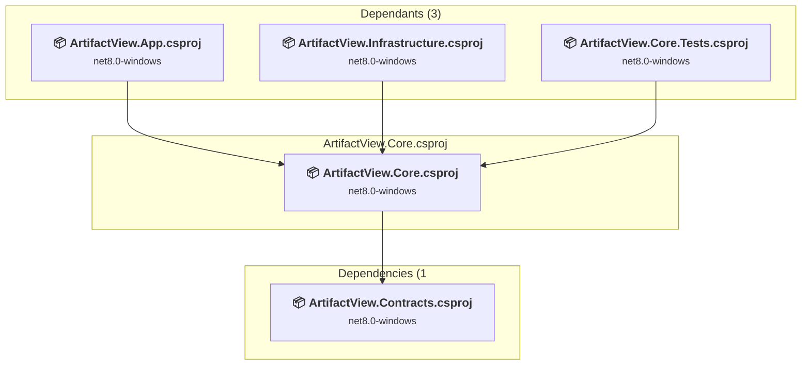
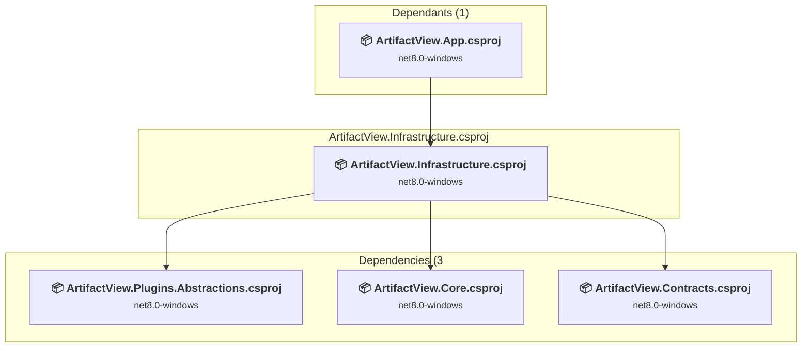
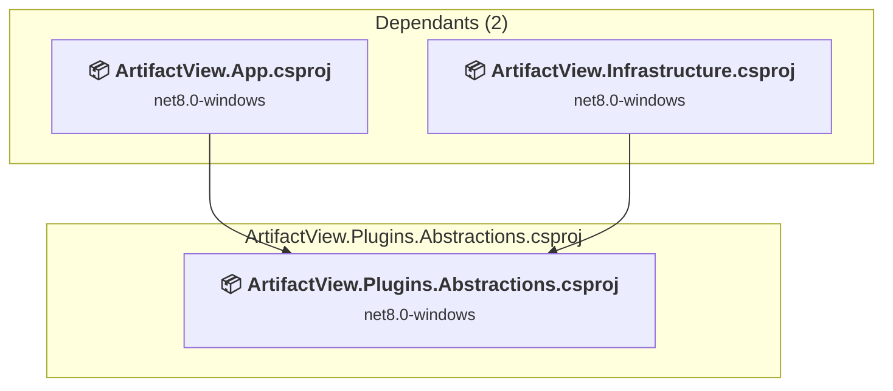
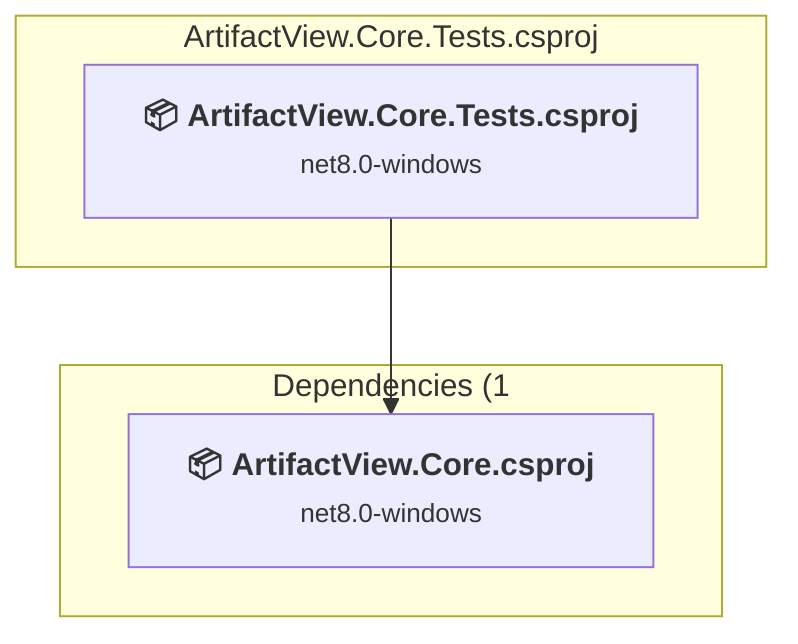

# Projects and dependencies analysis

This document provides a comprehensive overview of the projects and their dependencies in the context of upgrading to .NETCoreApp,Version=v10.0.

## Table of Contents

- [Executive Summary](#executive-Summary)
  - [Highlevel Metrics](#highlevel-metrics)
  - [Projects Compatibility](#projects-compatibility)
  - [Package Compatibility](#package-compatibility)
  - [API Compatibility](#api-compatibility)
- [Aggregate NuGet packages details](#aggregate-nuget-packages-details)
- [Top API Migration Challenges](#top-api-migration-challenges)
  - [Technologies and Features](#technologies-and-features)
  - [Most Frequent API Issues](#most-frequent-api-issues)
- [Projects Relationship Graph](#projects-relationship-graph)
- [Project Details](#project-details)

  - [src\ArtifactView.App\ArtifactView.App.csproj](#srcartifactviewappartifactviewappcsproj)
  - [src\ArtifactView.Contracts\ArtifactView.Contracts.csproj](#srcartifactviewcontractsartifactviewcontractscsproj)
  - [src\ArtifactView.Core\ArtifactView.Core.csproj](#srcartifactviewcoreartifactviewcorecsproj)
  - [src\ArtifactView.Infrastructure\ArtifactView.Infrastructure.csproj](#srcartifactviewinfrastructureartifactviewinfrastructurecsproj)
  - [src\ArtifactView.Plugins.Abstractions\ArtifactView.Plugins.Abstractions.csproj](#srcartifactviewpluginsabstractionsartifactviewpluginsabstractionscsproj)
  - [tests\ArtifactView.Core.Tests\ArtifactView.Core.Tests.csproj](#testsartifactviewcoretestsartifactviewcoretestscsproj)

## Executive Summary

### Highlevel Metrics

| Metric | Count | Status |
| :--- | :---: | :--- |
| Total Projects | 6 | All require upgrade |
| Total NuGet Packages | 7 | 3 need upgrade |
| Total Code Files | 57 |  |
| Total Code Files with Incidents | 22 |  |
| Total Lines of Code | 4130 |  |
| Total Number of Issues | 790 |  |
| Estimated LOC to modify | 781+ | at least 18.9% of codebase |

### Projects Compatibility

| Project | Target Framework | Difficulty | Package Issues | API Issues | Est. LOC Impact | Description |
| :--- | :---: | :---: | :---: | :---: | :---: | :--- |
| [src\ArtifactView.App\ArtifactView.App.csproj](#srcartifactviewappartifactviewappcsproj) | net8.0-windows | 🟡 Medium | 2 | 781 | 781+ | Wpf, Sdk Style = True |
| [src\ArtifactView.Contracts\ArtifactView.Contracts.csproj](#srcartifactviewcontractsartifactviewcontractscsproj) | net8.0-windows | 🟢 Low | 0 | 0 |  | ClassLibrary, Sdk Style = True |
| [src\ArtifactView.Core\ArtifactView.Core.csproj](#srcartifactviewcoreartifactviewcorecsproj) | net8.0-windows | 🟢 Low | 0 | 0 |  | ClassLibrary, Sdk Style = True |
| [src\ArtifactView.Infrastructure\ArtifactView.Infrastructure.csproj](#srcartifactviewinfrastructureartifactviewinfrastructurecsproj) | net8.0-windows | 🟢 Low | 1 | 0 |  | ClassLibrary, Sdk Style = True |
| [src\ArtifactView.Plugins.Abstractions\ArtifactView.Plugins.Abstractions.csproj](#srcartifactviewpluginsabstractionsartifactviewpluginsabstractionscsproj) | net8.0-windows | 🟢 Low | 0 | 0 |  | ClassLibrary, Sdk Style = True |
| [tests\ArtifactView.Core.Tests\ArtifactView.Core.Tests.csproj](#testsartifactviewcoretestsartifactviewcoretestscsproj) | net8.0-windows | 🟢 Low | 0 | 0 |  | DotNetCoreApp, Sdk Style = True |

### Package Compatibility

| Status | Count | Percentage |
| :--- | :---: | :---: |
| ✅ Compatible | 4 | 57.1% |
| ⚠️ Incompatible | 0 | 0.0% |
| 🔄 Upgrade Recommended | 3 | 42.9% |
| ***Total NuGet Packages*** | ***7*** | ***100%*** |

### API Compatibility

| Category | Count | Impact |
| :--- | :---: | :--- |
| 🔴 Binary Incompatible | 773 | High - Require code changes |
| 🟡 Source Incompatible | 1 | Medium - Needs re-compilation and potential conflicting API error fixing |
| 🔵 Behavioral change | 7 | Low - Behavioral changes that may require testing at runtime |
| ✅ Compatible | 3852 |  |
| ***Total APIs Analyzed*** | ***4633*** |  |

## Aggregate NuGet packages details

| Package | Current Version | Suggested Version | Projects | Description |
| :--- | :---: | :---: | :--- | :--- |
| MetadataExtractor | 2.8.1 |  | [ArtifactView.Infrastructure.csproj](#srcartifactviewinfrastructureartifactviewinfrastructurecsproj) | ✅Compatible |
| Microsoft.Data.Sqlite | 8.0.0 | 10.0.5 | [ArtifactView.Infrastructure.csproj](#srcartifactviewinfrastructureartifactviewinfrastructurecsproj) | NuGet package upgrade is recommended |
| Microsoft.Extensions.Logging | 8.0.1 | 10.0.5 | [ArtifactView.App.csproj](#srcartifactviewappartifactviewappcsproj) | NuGet package upgrade is recommended |
| Microsoft.Extensions.Logging.Debug | 8.0.1 | 10.0.5 | [ArtifactView.App.csproj](#srcartifactviewappartifactviewappcsproj) | NuGet package upgrade is recommended |
| Microsoft.NET.Test.Sdk | 17.11.1 |  | [ArtifactView.Core.Tests.csproj](#testsartifactviewcoretestsartifactviewcoretestscsproj) | ✅Compatible |
| xunit | 2.9.2 |  | [ArtifactView.Core.Tests.csproj](#testsartifactviewcoretestsartifactviewcoretestscsproj) | ✅Compatible |
| xunit.runner.visualstudio | 2.8.2 |  | [ArtifactView.Core.Tests.csproj](#testsartifactviewcoretestsartifactviewcoretestscsproj) | ✅Compatible |

## Top API Migration Challenges

### Technologies and Features

| Technology | Issues | Percentage | Migration Path |
| :--- | :---: | :---: | :--- |
| WPF (Windows Presentation Foundation) | 546 | 69.9% | WPF APIs for building Windows desktop applications with XAML-based UI that are available in .NET on Windows. WPF provides rich desktop UI capabilities with data binding and styling. Enable Windows Desktop support: Option 1 (Recommended): Target net9.0-windows; Option 2: Add <UseWindowsDesktop>true</UseWindowsDesktop>. |

### Most Frequent API Issues

| API | Count | Percentage | Category |
| :--- | :---: | :---: | :--- |
| T:System.Windows.Media.Imaging.BitmapSource | 61 | 7.8% | Binary Incompatible |
| T:System.Windows.Application | 49 | 6.3% | Binary Incompatible |
| T:System.Windows.Input.Key | 35 | 4.5% | Binary Incompatible |
| T:System.Windows.Visibility | 31 | 4.0% | Binary Incompatible |
| T:System.Windows.Threading.Dispatcher | 25 | 3.2% | Binary Incompatible |
| P:System.Windows.Threading.DispatcherObject.Dispatcher | 25 | 3.2% | Binary Incompatible |
| P:System.Windows.Application.Current | 23 | 2.9% | Binary Incompatible |
| T:System.Windows.Controls.Image | 22 | 2.8% | Binary Incompatible |
| P:System.Windows.Media.Imaging.BitmapSource.PixelHeight | 16 | 2.0% | Binary Incompatible |
| T:System.Windows.Controls.TextBlock | 16 | 2.0% | Binary Incompatible |
| T:System.Windows.Media.BitmapScalingMode | 16 | 2.0% | Binary Incompatible |
| M:System.Windows.Threading.Dispatcher.Invoke(System.Action) | 16 | 2.0% | Binary Incompatible |
| P:System.Windows.Media.Imaging.BitmapSource.PixelWidth | 15 | 1.9% | Binary Incompatible |
| T:System.Windows.Media.ImageSource | 14 | 1.8% | Binary Incompatible |
| P:System.Windows.Controls.Image.Source | 14 | 1.8% | Binary Incompatible |
| T:System.Windows.Media.Imaging.BitmapCacheOption | 14 | 1.8% | Binary Incompatible |
| T:System.Windows.Media.Imaging.BitmapCreateOptions | 14 | 1.8% | Binary Incompatible |
| T:System.Windows.Media.Imaging.BitmapDecoder | 14 | 1.8% | Binary Incompatible |
| T:System.Windows.Controls.DataGrid | 14 | 1.8% | Binary Incompatible |
| P:System.Windows.UIElement.Visibility | 9 | 1.2% | Binary Incompatible |
| M:System.Windows.Freezable.Freeze | 8 | 1.0% | Binary Incompatible |
| P:System.Windows.Media.Imaging.BitmapDecoder.Frames | 8 | 1.0% | Binary Incompatible |
| P:System.Windows.RoutedEventArgs.Handled | 7 | 0.9% | Binary Incompatible |
| T:System.Windows.Media.Imaging.BitmapFrame | 7 | 0.9% | Binary Incompatible |
| F:System.Windows.Media.Imaging.BitmapCreateOptions.IgnoreColorProfile | 7 | 0.9% | Binary Incompatible |
| M:System.Windows.Media.Imaging.BitmapDecoder.Create(System.IO.Stream,System.Windows.Media.Imaging.BitmapCreateOptions,System.Windows.Media.Imaging.BitmapCacheOption) | 7 | 0.9% | Binary Incompatible |
| T:System.Windows.Threading.DispatcherTimer | 7 | 0.9% | Binary Incompatible |
| T:System.Windows.Media.PixelFormat | 7 | 0.9% | Binary Incompatible |
| F:System.Windows.Visibility.Collapsed | 6 | 0.8% | Binary Incompatible |
| F:System.Windows.Media.Imaging.BitmapCacheOption.OnLoad | 6 | 0.8% | Binary Incompatible |
| T:System.Windows.Threading.DispatcherPriority | 6 | 0.8% | Binary Incompatible |
| P:System.Windows.Controls.TextBlock.Text | 5 | 0.6% | Binary Incompatible |
| T:System.Windows.Media.ScaleTransform | 5 | 0.6% | Binary Incompatible |
| F:System.Windows.Visibility.Visible | 5 | 0.6% | Binary Incompatible |
| P:System.Windows.Media.Imaging.BitmapSource.Format | 5 | 0.6% | Binary Incompatible |
| T:System.ComponentModel.SortDescriptionCollection | 5 | 0.6% | Binary Incompatible |
| P:System.ComponentModel.ICollectionView.SortDescriptions | 5 | 0.6% | Binary Incompatible |
| P:System.Windows.FrameworkElement.DataContext | 5 | 0.6% | Binary Incompatible |
| T:System.Windows.Controls.ScrollViewer | 4 | 0.5% | Binary Incompatible |
| T:System.Windows.Input.Cursor | 4 | 0.5% | Binary Incompatible |
| M:System.Windows.UIElement.Focus | 4 | 0.5% | Binary Incompatible |
| T:System.Windows.RoutedEventHandler | 4 | 0.5% | Binary Incompatible |
| T:System.Windows.Input.MouseEventHandler | 4 | 0.5% | Binary Incompatible |
| M:System.Windows.Window.#ctor | 4 | 0.5% | Binary Incompatible |
| T:System.Uri | 4 | 0.5% | Behavioral Change |
| T:System.Windows.Data.CollectionViewSource | 4 | 0.5% | Binary Incompatible |
| T:System.ComponentModel.ICollectionView | 4 | 0.5% | Binary Incompatible |
| M:System.Windows.Data.CollectionViewSource.GetDefaultView(System.Object) | 4 | 0.5% | Binary Incompatible |
| T:System.ComponentModel.SortDescription | 4 | 0.5% | Binary Incompatible |
| M:System.ComponentModel.SortDescription.#ctor(System.String,System.ComponentModel.ListSortDirection) | 4 | 0.5% | Binary Incompatible |

## Projects Relationship Graph

Legend:
📦 SDK-style project
⚙️ Classic project

## Project Details

### src\ArtifactView.App\ArtifactView.App.csproj

#### Project Info

- **Current Target Framework:** net8.0-windows
- **Proposed Target Framework:** net10.0-windows
- **SDK-style**: True
- **Project Kind:** Wpf
- **Dependencies**: 4
- **Dependants**: 0
- **Number of Files**: 13
- **Number of Files with Incidents**: 17
- **Lines of Code**: 2226
- **Estimated LOC to modify**: 781+ (at least 35.1% of the project)

#### Dependency Graph

Legend:
📦 SDK-style project
⚙️ Classic project

### API Compatibility

| Category | Count | Impact |
| :--- | :---: | :--- |
| 🔴 Binary Incompatible | 773 | High - Require code changes |
| 🟡 Source Incompatible | 1 | Medium - Needs re-compilation and potential conflicting API error fixing |
| 🔵 Behavioral change | 7 | Low - Behavioral changes that may require testing at runtime |
| ✅ Compatible | 2019 |  |
| ***Total APIs Analyzed*** | ***2800*** |  |

#### Project Technologies and Features

| Technology | Issues | Percentage | Migration Path |
| :--- | :---: | :---: | :--- |
| WPF (Windows Presentation Foundation) | 546 | 69.9% | WPF APIs for building Windows desktop applications with XAML-based UI that are available in .NET on Windows. WPF provides rich desktop UI capabilities with data binding and styling. Enable Windows Desktop support: Option 1 (Recommended): Target net9.0-windows; Option 2: Add <UseWindowsDesktop>true</UseWindowsDesktop>. |

### src\ArtifactView.Contracts\ArtifactView.Contracts.csproj

#### Project Info

- **Current Target Framework:** net8.0-windows
- **Proposed Target Framework:** net10.0--windows
- **SDK-style**: True
- **Project Kind:** ClassLibrary
- **Dependencies**: 0
- **Dependants**: 3
- **Number of Files**: 13
- **Number of Files with Incidents**: 1
- **Lines of Code**: 106
- **Estimated LOC to modify**: 0+ (at least 0.0% of the project)

#### Dependency Graph

Legend:
📦 SDK-style project
⚙️ Classic project

### API Compatibility

| Category | Count | Impact |
| :--- | :---: | :--- |
| 🔴 Binary Incompatible | 0 | High - Require code changes |
| 🟡 Source Incompatible | 0 | Medium - Needs re-compilation and potential conflicting API error fixing |
| 🔵 Behavioral change | 0 | Low - Behavioral changes that may require testing at runtime |
| ✅ Compatible | 110 |  |
| ***Total APIs Analyzed*** | ***110*** |  |

### src\ArtifactView.Core\ArtifactView.Core.csproj

#### Project Info

- **Current Target Framework:** net8.0-windows
- **Proposed Target Framework:** net10.0--windows
- **SDK-style**: True
- **Project Kind:** ClassLibrary
- **Dependencies**: 1
- **Dependants**: 3
- **Number of Files**: 11
- **Number of Files with Incidents**: 1
- **Lines of Code**: 282
- **Estimated LOC to modify**: 0+ (at least 0.0% of the project)

#### Dependency Graph

Legend:
📦 SDK-style project
⚙️ Classic project

### API Compatibility

| Category | Count | Impact |
| :--- | :---: | :--- |
| 🔴 Binary Incompatible | 0 | High - Require code changes |
| 🟡 Source Incompatible | 0 | Medium - Needs re-compilation and potential conflicting API error fixing |
| 🔵 Behavioral change | 0 | Low - Behavioral changes that may require testing at runtime |
| ✅ Compatible | 330 |  |
| ***Total APIs Analyzed*** | ***330*** |  |

### src\ArtifactView.Infrastructure\ArtifactView.Infrastructure.csproj

#### Project Info

- **Current Target Framework:** net8.0-windows
- **Proposed Target Framework:** net10.0--windows
- **SDK-style**: True
- **Project Kind:** ClassLibrary
- **Dependencies**: 3
- **Dependants**: 1
- **Number of Files**: 16
- **Number of Files with Incidents**: 1
- **Lines of Code**: 1379
- **Estimated LOC to modify**: 0+ (at least 0.0% of the project)

#### Dependency Graph

Legend:
📦 SDK-style project
⚙️ Classic project

### API Compatibility

| Category | Count | Impact |
| :--- | :---: | :--- |
| 🔴 Binary Incompatible | 0 | High - Require code changes |
| 🟡 Source Incompatible | 0 | Medium - Needs re-compilation and potential conflicting API error fixing |
| 🔵 Behavioral change | 0 | Low - Behavioral changes that may require testing at runtime |
| ✅ Compatible | 1264 |  |
| ***Total APIs Analyzed*** | ***1264*** |  |

### src\ArtifactView.Plugins.Abstractions\ArtifactView.Plugins.Abstractions.csproj

#### Project Info

- **Current Target Framework:** net8.0-windows
- **Proposed Target Framework:** net10.0--windows
- **SDK-style**: True
- **Project Kind:** ClassLibrary
- **Dependencies**: 0
- **Dependants**: 2
- **Number of Files**: 2
- **Number of Files with Incidents**: 1
- **Lines of Code**: 34
- **Estimated LOC to modify**: 0+ (at least 0.0% of the project)

#### Dependency Graph

Legend:
📦 SDK-style project
⚙️ Classic project

### API Compatibility

| Category | Count | Impact |
| :--- | :---: | :--- |
| 🔴 Binary Incompatible | 0 | High - Require code changes |
| 🟡 Source Incompatible | 0 | Medium - Needs re-compilation and potential conflicting API error fixing |
| 🔵 Behavioral change | 0 | Low - Behavioral changes that may require testing at runtime |
| ✅ Compatible | 47 |  |
| ***Total APIs Analyzed*** | ***47*** |  |

### tests\ArtifactView.Core.Tests\ArtifactView.Core.Tests.csproj

#### Project Info

- **Current Target Framework:** net8.0-windows
- **Proposed Target Framework:** net10.0--windows
- **SDK-style**: True
- **Project Kind:** DotNetCoreApp
- **Dependencies**: 1
- **Dependants**: 0
- **Number of Files**: 4
- **Number of Files with Incidents**: 1
- **Lines of Code**: 103
- **Estimated LOC to modify**: 0+ (at least 0.0% of the project)

#### Dependency Graph

Legend:
📦 SDK-style project
⚙️ Classic project

### API Compatibility

| Category | Count | Impact |
| :--- | :---: | :--- |
| 🔴 Binary Incompatible | 0 | High - Require code changes |
| 🟡 Source Incompatible | 0 | Medium - Needs re-compilation and potential conflicting API error fixing |
| 🔵 Behavioral change | 0 | Low - Behavioral changes that may require testing at runtime |
| ✅ Compatible | 82 |  |
| ***Total APIs Analyzed*** | ***82*** |  |

